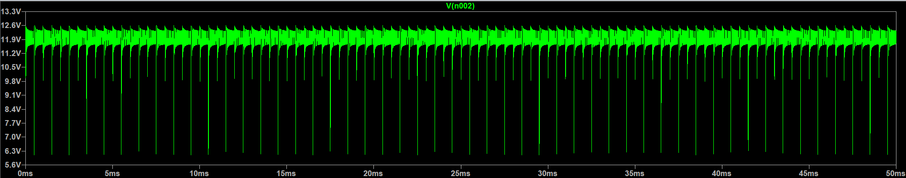
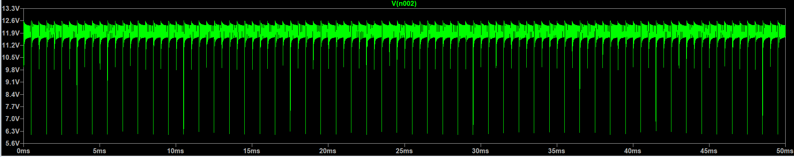
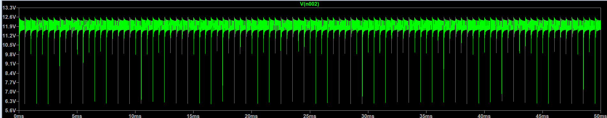
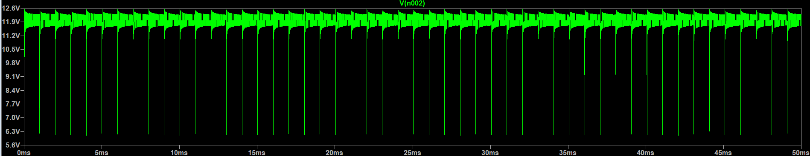
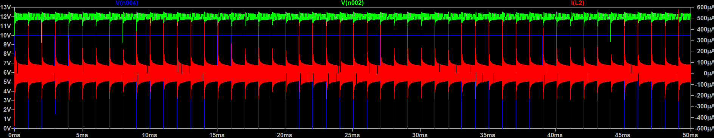

# PWM-Based DC Motor Speed Controller

## Overview

This project implements a PWM-based DC motor speed controller using an N-channel MOSFET in LTspice. The motor speed is controlled by varying the PWM duty cycle, which changes the average voltage applied to the motor.

## Features

- PWM speed control
- MOSFET switching circuit
- Flyback diode protection
- LTspice transient simulation
- Duty cycle comparison

## Components Used

- 12 V DC Voltage Source
- PWM Voltage Source
- N-Channel MOSFET
- 2 Ω Resistor
- 10 mH Inductor (Motor Model)
- 1N4007 Flyback Diode

## Simulation Setup

- Supply Voltage: 12 V
- PWM Frequency: 1 kHz
- Duty Cycles:
  - 25%
  - 50%
  - 75%
  - 100%

## Results

### 25% Duty Cycle

### 50% Duty Cycle

### 75% Duty Cycle

### 100% Duty Cycle

### Switching Waveforms

## Observations

- Increasing the PWM duty cycle increases the average voltage applied to the motor.
- Higher duty cycles produce higher motor current.
- The MOSFET switches according to the PWM signal.
- The flyback diode suppresses inductive voltage spikes when the MOSFET turns OFF.

## Conclusion

The LTspice simulation demonstrates that PWM effectively controls the average voltage supplied to the motor. Increasing the PWM duty cycle increases the motor voltage and current, resulting in higher motor speed while the flyback diode protects the MOSFET during switching.

## Software

- LTspice
